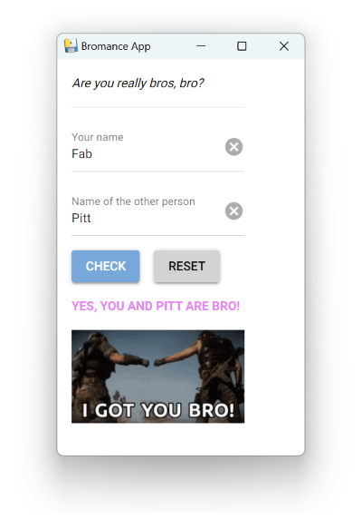

# "Are we bro?" application

  

Close to be the stupidest application on Earth, but it was funny to reach a goal set by my friends :grin:

This serves also as a playground to learn about UI development in Python, pytest, pyinstaller and GitHub internals.

Built with [NiceGUI](https://github.com/zauberzeug/nicegui/)

TODO:

- [x] unit tests

- [x] release tag

- [x] installer

- [x] Github action

- [ ] better string compare

- [ ] configurable name list

- [ ] build package on push

